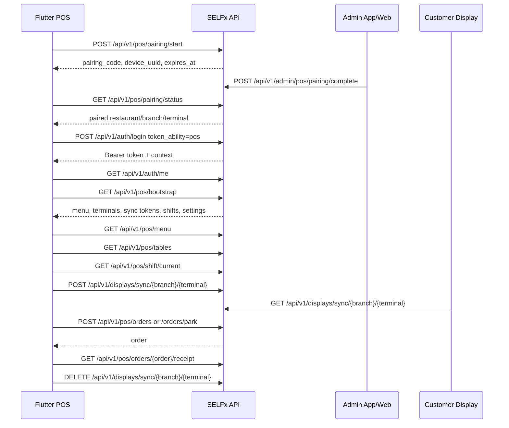
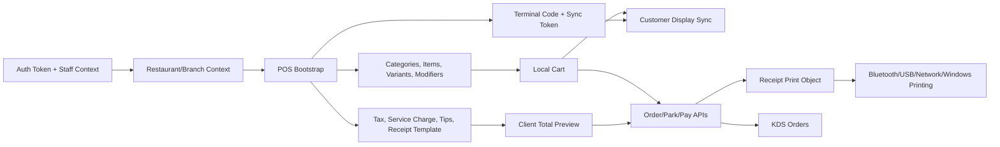

# SELFx POS Flutter APK Discovery Report

Date: 2026-06-29

Scope: discovery and reverse engineering only. No Flutter code, screens, project structure, backend changes, or mutating business operations were created.

## Methodology

- Logged in to `https://selfx.laravel.cloud` with the supplied account.
- Parsed the Laravel/Inertia page payloads and Ziggy route map from authenticated HTML.
- Used the Developer Hub at `/super-admin/developer` as the official API reference.
- Entered restaurant context by impersonating `Demo Bistro` from the super-admin account, then inspected restaurant-admin/POS/Kitchen page payloads.
- Read compiled frontend chunks for POS and POS-terminal admin behavior.
- Verified read-only API calls with a POS-scoped Sanctum token.
- Performed one harmless POS pairing start/status probe. The code expires and was not completed.
- Redacted bearer tokens, terminal sync tokens, print bridge keys, and pairing codes.

Important limitation: this Codex session did not expose a controllable visual browser surface, so visual clicking/screenshots were not available. The inspection was performed through authenticated HTML/Inertia props, frontend chunks, route metadata, Developer Hub payloads, and live API responses.

## Observed Page Coverage

Super-admin context:

| URL | Inertia Component | Key Hydrated Data |
|---|---|---|
| `/dashboard` | `Dashboard` | SaaS restaurant/plan/billing stats |
| `/super-admin/restaurants` | `SuperAdmin/Restaurants/Index` | restaurants, plans, status stats, filters |
| `/super-admin/staff` | `SuperAdmin/Staff/Index` | staff, roles |
| `/super-admin/roles` | `SuperAdmin/Roles/Index` | roles, permissions count |
| `/super-admin/plans` | `SuperAdmin/Plans/Index` | plan groups |
| `/super-admin/billing` | `SuperAdmin/Billing/Index` | restaurants |
| `/super-admin/payments` | `SuperAdmin/Payments/Index` | payments, stats, filters, restaurants, plans |
| `/super-admin/payment-gateways` | `SuperAdmin/PaymentGateways/Index` | gateways |
| `/super-admin/ai-settings` | `SuperAdmin/AiSettings/Index` | provider settings, models, limits |
| `/super-admin/landing-page` | `SuperAdmin/LandingPage/Index` | landing content blocks |
| `/super-admin/settings` | `SuperAdmin/Settings/Index` | app settings, timezones, locales, currencies, plans |
| `/super-admin/app-downloads` | `SuperAdmin/AppDownloads/Index` | app download page/content/platforms |
| `/super-admin/developer` | `SuperAdmin/Developer/Index` | `apiReference` |

Restaurant context: Demo Bistro / Downtown.

| URL | Inertia Component | Key Hydrated Data |
|---|---|---|
| `/dashboard` | `Dashboard` | setup checklist, plan usage, branch stats, recent orders, display URLs |
| `/pos` | `Pos/Index` | restaurant, branch, receipt settings, categories, tables, customers, shift, terminals |
| `/kitchen` | `Kitchen/Index` | restaurant, branch, orders by status, kitchens |
| `/order-board` | `Admin/OrderBoard/Index` | preparing/ready orders, board URL |
| `/admin/branches` | `Admin/Branches/Index` | branches, plan limits, summary |
| `/admin/menu` | `Admin/Menu/Overview` | categories, menu stats |
| `/admin/menu-categories` | `Admin/MenuCategories/Index` | category pagination, filters, summary |
| `/admin/menu-items` | `Admin/MenuItems/Index` | item pagination, categories, filters, summary |
| `/admin/menu-modifiers` | `Admin/MenuModifiers/Index` | modifiers, summary |
| `/admin/orders` | `Admin/Orders/Index` | orders, revenue, summary, branches, filters |
| `/admin/pos-terminals` | `Admin/PosTerminals/Index` | terminals, pairing status, stats |
| `/admin/kitchens` | `Admin/Kitchens/Index` | kitchens, default kitchen, category/item assignments |
| `/admin/printers` | `Admin/Printers/Index` | print bridge status, printers, kitchens, terminals |
| `/admin/app-downloads` | `Admin/AppDownloads/Index` | restaurant app downloads content |
| `/admin/kiosk` | `Admin/Kiosk/Index` | kiosk settings, payment preview, terminals |
| `/admin/tables` | `Admin/Tables/Index` | table areas, statuses, permissions |
| `/admin/floor-plan` | `Admin/Tables/FloorPlan` | floors, active floor, tables |
| `/admin/floor-live` | `Admin/Tables/FloorLive` | live floor stats/tables |
| `/admin/shifts` | `Admin/Shifts/Index` | open shift, summaries, shift list |
| `/admin/reservations` | `Admin/Reservations/Index` | reservations, tables, filters, stats |
| `/admin/customers` | `Admin/Customers/Index` | customers, filters |
| `/admin/reports` | `Admin/Reports/Index` | branch filters, sales/order/tax/discount/tip/service summaries |
| `/admin/receipt-settings` | `Admin/ReceiptSettings/Index` | receipt settings, preview orders |
| `/admin/settings` | `Admin/Settings/Index` | theme, restaurant settings, display links |
| `/admin/payment-gateways` | `Admin/PaymentGateways/Index` | gateways, online payment flag |
| `/admin/billing` | `Admin/Billing/Index` | plan, plan groups, trial/payment status |

## 1. Complete Platform Architecture

SELFX is a Laravel + Inertia SaaS platform with a React/Vite frontend and Laravel Sanctum APIs. The application exposes:

- Super-admin SaaS management: restaurants, plans, billing, payments, staff, roles, global settings, AI settings, landing page, app downloads, Developer Hub.
- Restaurant admin portal: dashboard, branches, menu, categories, items, modifiers, orders, tables, floor plan, shifts, reservations, customers, reports, receipt settings, payment gateways, printers, kiosk, POS terminals, billing.
- Web POS at `/pos`: staff-operated order entry, terminal selection, customer display sync, shift open/close, cart, discounts, tips, payments, receipts.
- Kitchen display at `/kitchen`: order grouping and status updates.
- Customer display/order board/storefront: public or token-backed guest-facing views.
- Device APIs under `/api/v1`: POS mobile, kiosk, kiosk admin, kitchen, admin mobile, customer display sync, menu display TV, print bridge, storefront.

Verified architecture points:

- Initial route registry contained 384 named routes and 89 `/api/v1/*` endpoints.
- API reference version is `2`.
- Staff/mobile APIs use `{ data, meta }` response envelopes.
- Kiosk routes can return legacy flat JSON for device compatibility.
- Realtime config exists but current driver is `null`; payloads still include `private-branch.{id}` channel names and expected events.

## 2. Authentication Flow

Primary mobile/POS auth is Laravel Sanctum:

```http
POST /api/v1/auth/login
Content-Type: application/json
```

Request:

```json
{
  "email": "admin@serveai.test",
  "password": "password",
  "device_name": "POS tablet",
  "token_ability": "pos",
  "restaurant_id": 1,
  "branch_id": 1
}
```

Response includes:

- `data.token`
- `data.token_type = Bearer`
- `data.abilities`
- `data.user`
- `data.is_super_admin`
- `data.restaurants[]`
- `data.current_restaurant`
- `data.current_branch`
- `data.permissions[]`
- `data.plan_features[]`
- `data.realtime`

Every staff/POS request must send:

```http
Authorization: Bearer {token}
X-Restaurant-Id: {restaurant_id}
X-Branch-Id: {branch_id}
Accept: application/json
Content-Type: application/json   # mutating requests
```

Context APIs:

- `GET /api/v1/auth/me`
- `POST /api/v1/auth/switch-restaurant`
- `POST /api/v1/auth/switch-branch`
- `POST /api/v1/auth/logout`

POS PIN APIs:

- `POST /api/v1/auth/set-pos-pin`
- `POST /api/v1/auth/verify-pos-pin`

Permissions and plan features are enforced server-side. Missing permission returns `403`.

## 3. Device Pairing Flow

POS tablet pairing is optional for device setup, not a replacement for staff login.

Start pairing:

```http
POST /api/v1/pos/pairing/start
Content-Type: application/json
X-Pos-Platform: android
X-Pos-App-Version: 1.0.0
```

Body:

```json
{
  "platform": "android",
  "app_version": "1.0.0",
  "device_name": "Front counter tablet"
}
```

Response:

```json
{
  "pairing_code": "redacted-six-digit-code",
  "device_uuid": "uuid",
  "expires_at": "2026-06-29T07:11:22+00:00"
}
```

Poll:

```http
GET /api/v1/pos/pairing/status?device_uuid={uuid}
```

Pending response:

```json
{
  "status": "pending",
  "pairing_code": "redacted-six-digit-code",
  "expires_at": "..."
}
```

Paired response, per Developer Hub:

```json
{
  "status": "paired",
  "restaurant_id": 1,
  "restaurant_name": "Demo Bistro",
  "branch_id": 1,
  "branch_name": "Main",
  "pos_terminal": {
    "id": 1,
    "code": "T1",
    "name": "Front counter"
  }
}
```

## 4. POS Pairing Flow

Sequence:

1. Flutter POS starts pairing and displays the six-digit code.
2. Admin opens restaurant admin POS terminals.
3. Admin chooses a terminal and enters `pairing_code`.
4. Backend binds the tablet/device UUID to that terminal/branch.
5. Device polling changes from `pending` to `paired`.
6. Device stores paired restaurant/branch/terminal metadata.
7. Staff still logs in via Sanctum with `token_ability: "pos"`.
8. POS bootstraps and must still send `X-Restaurant-Id` and `X-Branch-Id`.

Admin completion APIs:

- Web admin: `POST /admin/pos-terminals/{posTerminal}/pair` with `pairing_code`.
- Admin mobile: `POST /api/v1/admin/pos/pairing/complete` with `pairing_code` and `pos_terminal_id`.

## 5. Terminal Binding Flow

Restaurant admin manages terminals at `/admin/pos-terminals`.

Terminal fields verified from page/API:

- `id`
- `code`, e.g. `T1`
- `name`, e.g. `Terminal 1`
- `sync_token` (secret, redacted)
- `display_url`, e.g. `/order/demo-restaurant/display/1/T1`

The web POS stores selected terminal code in browser local storage using:

```text
serve_pos_terminal_{branchId}
```

It emits a frontend event:

```text
serve-pos-terminal-changed
```

Flutter should persist selected terminal per branch in secure/local app storage. Use only one active POS client per physical register because customer-display sync is a single mirror per terminal.

## 6. Restaurant & Branch Architecture

The authenticated test account can access multiple restaurants. Demo data includes:

- `Demo Bistro`, slug `demo-restaurant`, branches `Downtown` and `Mall Location`.
- Other restaurants include Kumar Bistro, ONENESS, Sakura Sushi Bar, The Gourmet Kitchen.

Isolation rule:

- Every staff/POS request must include `X-Restaurant-Id` and `X-Branch-Id`.
- The client must never reuse cached menu/order/customer data across restaurant or branch boundaries.
- Local offline storage keys must be scoped by `restaurant_id`, `branch_id`, and terminal code.

Verified Demo Bistro branch:

- Restaurant ID: `1`
- Branch ID: `1`
- Branch name: `Downtown`
- Address: `123 Tech Avenue, Innovation City`
- Currency from POS bootstrap: `INR`

## 7. API Inventory

Developer Hub groups:

| Group | Base Path | Auth | Endpoints |
|---|---|---|---:|
| Kiosk pairing | `/api/v1/kiosk/pairing` | none | 2 |
| POS tablet pairing | `/api/v1/pos/pairing` | none | 2 |
| Kiosk device API | `/api/v1/kiosk` | `X-Kiosk-Token` | 9 |
| Kiosk admin API | `/api/v1/kiosk/admin` | kiosk + admin token | 12 |
| Customer display cart sync | `/api/v1/displays/sync` | `X-Terminal-Token` | 3 |
| Webhooks | mixed | none/signature | 3 |
| Public AI chat | `/ai/public/chat` | none | 1 |
| Staff auth | `/api/v1/auth` | Sanctum except login | 7 |
| POS mobile API | `/api/v1/pos` | Sanctum | 15 |
| Kitchen display API | `/api/v1/kitchen` | Sanctum | 4 |
| Order board API | `/api/v1` | Sanctum/public | 2 |
| Admin mobile API | `/api/v1/admin` | Sanctum | 16 |
| Menu display API | `/api/v1/menu-display` | device token after pairing | 4 |
| Print bridge | `/api/v1/print-bridge` | `X-Print-Bridge-Key` | 4 |
| Customer display bootstrap | `/api/v1/display` | terminal token in practice | 1 |
| Customer storefront API | `/api/v1/storefront/{restaurant}` | none | 6 |

## 8. Authentication APIs

| Method | Endpoint | Purpose |
|---|---|---|
| POST | `/api/v1/auth/login` | Get Sanctum token |
| POST | `/api/v1/auth/logout` | Revoke current token |
| GET | `/api/v1/auth/me` | User, permissions, restaurants, current context |
| POST | `/api/v1/auth/switch-restaurant` | Change restaurant |
| POST | `/api/v1/auth/switch-branch` | Change branch |
| POST | `/api/v1/auth/verify-pos-pin` | Unlock local POS PIN gate |
| POST | `/api/v1/auth/set-pos-pin` | Set/change POS PIN |

## 9. Pairing APIs

| Method | Endpoint | Purpose |
|---|---|---|
| POST | `/api/v1/pos/pairing/start` | Create POS device pairing code |
| GET | `/api/v1/pos/pairing/status?device_uuid=...` | Poll POS pairing |
| POST | `/api/v1/admin/pos/pairing/complete` | Admin mobile completes POS pairing |
| POST | `/admin/pos-terminals/{id}/pair` | Web admin completes POS pairing |
| POST | `/api/v1/kiosk/pairing/start` | Create kiosk pairing code |
| GET | `/api/v1/kiosk/pairing/status?device_uuid=...` | Poll kiosk pairing |
| POST | `/api/v1/menu-display/pairing/start` | Create menu display pairing code |
| GET | `/api/v1/menu-display/pairing/status` | Poll menu display pairing |

## 10. POS Bootstrap APIs

Primary call:

```http
GET /api/v1/pos/bootstrap
Authorization: Bearer {token}
X-Restaurant-Id: 1
X-Branch-Id: 1
```

Verified response includes:

- `restaurant`: branding, slug, tax settings, currency, service charge, tips, receipt print mode.
- `branch`: branch identity/address/phone.
- `receipt_settings`: receipt and token template blocks.
- `popular_items[]`
- `categories[]`
- `branches[]`
- `current_shift`
- `require_shift_for_pos`
- `pos_blocked`
- `pos_terminals[]`
- `permissions[]`
- `plan_features[]`
- `sync.menu_revision`
- `sync.bootstrap_revision`

Follow-up refresh:

- `GET /api/v1/pos/menu`: categories + valid menu item IDs + menu revision.
- `GET /api/v1/pos/tables`: table areas, tables, status.
- `GET /api/v1/pos/shift/current`: current shift.
- `GET /api/v1/pos/open-orders`: held/draft tickets.

## 11. Categories APIs

POS category/menu data comes from:

- `GET /api/v1/pos/menu`
- `GET /api/v1/admin/menu`
- Admin web routes under `/admin/menu-categories`

Verified POS menu category shape:

```json
{
  "id": 1,
  "name": "Starters",
  "description": null,
  "sort_order": 1,
  "image_url": null,
  "items": []
}
```

Admin mobile availability:

- `POST /api/v1/admin/menu/categories/{menuCategory}/toggle-active`

## 12. Products APIs

POS products are nested under categories from:

- `GET /api/v1/pos/bootstrap`
- `GET /api/v1/pos/menu`

Verified item with options:

```json
{
  "id": 5,
  "name": "Beef Burger",
  "price": 12.99,
  "variants": [
    {"id": 1, "name": "Regular", "price": 12.99},
    {"id": 2, "name": "Double Patty", "price": 15.99}
  ],
  "modifiers": [
    {
      "id": 1,
      "name": "Size",
      "type": "single",
      "min_selections": 0,
      "max_selections": 1,
      "options": [{"id": 2, "name": "Medium", "price_adjustment": 1.5}]
    }
  ]
}
```

Admin mobile item APIs:

- `PATCH /api/v1/admin/menu/items/{menuItem}`
- `POST /api/v1/admin/menu/items/{menuItem}/toggle-available`

## 13. Cart APIs

There is no separate server cart API for POS. The POS client maintains cart state locally and sends it when parking, creating, or paying an order.

Cart line payload:

```json
{
  "menu_item_id": 5,
  "variant_id": 2,
  "quantity": 1,
  "notes": null,
  "modifiers": [
    {
      "modifier_option_id": 4,
      "modifier_name": "Extras",
      "option_name": "Cheese",
      "price_adjustment": 0.75,
      "quantity": 1
    }
  ]
}
```

Customer display cart mirror:

- `POST /api/v1/displays/sync/{branchId}/{terminalCode}`
- `DELETE /api/v1/displays/sync/{branchId}/{terminalCode}`
- Header: `X-Terminal-Token: {sync_token}`

Web POS debounces sync by about 300ms.

## 14. Customer APIs

POS:

```http
GET /api/v1/pos/customers/search?q=ja
```

Verified response:

```json
{
  "data": {
    "customers": [
      {
        "id": 2,
        "name": "Jane Smith",
        "phone": "+1555111002",
        "email": "jane@demo.test",
        "address": "456 Buyer Ave"
      }
    ]
  }
}
```

Admin web customer routes exist under `/admin/customers`. Storefront customer identity is submitted in storefront/POS order payloads.

## 15. Order APIs

POS mobile:

| Method | Endpoint | Purpose |
|---|---|---|
| GET | `/api/v1/pos/open-orders` | Held/draft tickets |
| POST | `/api/v1/pos/orders` | Create and optionally pay order |
| POST | `/api/v1/pos/orders/park` | Hold/park order |
| GET | `/api/v1/pos/orders/{order}` | Order detail; observed 404 for completed sample order |
| PUT | `/api/v1/pos/orders/{order}` | Update draft |
| POST | `/api/v1/pos/orders/{order}/pay` | Pay parked order |
| GET | `/api/v1/pos/orders/{order}/receipt` | Receipt/print object |

Create/pay request shape:

```json
{
  "items": [],
  "type": "dine_in",
  "table_id": null,
  "customer_id": null,
  "customer_name": "Guest",
  "customer_phone": null,
  "customer_address": null,
  "notes": null,
  "pos_terminal_code": "T1",
  "discount": {
    "type": "percent",
    "value": 10,
    "reason": "Promo"
  },
  "pos_register_payment": {
    "method": "cash",
    "cash_tendered": 50,
    "tip": 5
  }
}
```

Known order types from web POS:

- `dine_in`
- `takeaway`
- `delivery`

The charge calculator maps `takeaway` to backend surcharge key `pickup`.

Integration risks:

- `GET /api/v1/admin/orders` returned `500 Server Error` for the tested context.
- `GET /api/v1/pos/orders/88` returned `404`, while `GET /api/v1/pos/orders/88/receipt` returned `200`. Treat POS show as likely scoped to open/draft/order-access rules and rely on receipt endpoint for print payloads.

## 16. Payment APIs

Payment happens through:

- `POST /api/v1/pos/orders` with `pos_register_payment`
- `POST /api/v1/pos/orders/{order}/pay`

Payment methods observed in web POS:

- `cash`
- `card`
- `wallet`
- `other`
- `pay_later`

Cash behavior:

- POS pre-fills tendered amount with amount due.
- Cash requires `cash_tendered >= total`.
- Client calculates change locally.
- Backend validates `pos_register_payment.cash_tendered`.

Tips:

- POS bootstrap returns `tips.enabled` and presets `[10, 15, 18, 20]`.
- Payment payload uses `tip` as amount, not percentage.

Split/additional payment support exists in web admin order payments:

- `GET /admin/orders/{order}/payments`
- `POST /admin/orders/{order}/payments`

Those are web/session endpoints, not `/api/v1` POS endpoints.

## 17. Receipt APIs

Receipt endpoint:

```http
GET /api/v1/pos/orders/{order}/receipt
```

Verified response for order `88` includes:

- `data.order`
- `data.print_object.version`
- `data.print_object.paper`
- `data.print_object.font_size`
- `data.print_object.print_object[]`

Print object commands include:

- `init`
- `logo`
- `text`
- `divider`
- `row`
- `qr`
- `feed`
- `cut`

Example command:

```json
{
  "type": "row",
  "left": "Subtotal",
  "right": "¤13.99"
}
```

Receipt settings from bootstrap include editable template blocks for receipt and token/KOT printing.

## 18. Printer Flow

Printing has two paths:

1. POS receipt payload:
   - Flutter calls `GET /api/v1/pos/orders/{order}/receipt`.
   - Flutter converts `print_object[]` to ESC/POS, native print dialog, Bluetooth, USB, or network printer commands.

2. Print bridge desktop app:
   - Authenticates with `X-Print-Bridge-Key` from Admin → Printers.
   - `GET /api/v1/print-bridge/bootstrap`
   - `GET /api/v1/print-bridge/jobs/pending`
   - `POST /api/v1/print-bridge/jobs/{job}/complete`
   - `POST /api/v1/print-bridge/heartbeat`

Verified print bridge bootstrap includes:

- branch
- restaurant
- domain URL
- bridge online status
- printers
- kitchens and kitchen printer assignment

For Flutter POS, do not require the print bridge unless implementing a separate Windows/desktop print daemon. Use receipt print objects directly for Android/Windows device printing.

## 19. Customer Display Flow

Display URL:

```text
/order/{restaurantSlug}/display/{branchId}/{terminalCode}
```

Bootstrap:

```http
GET /api/v1/display/{branchId}/{terminalCode}/bootstrap
X-Terminal-Token: {sync_token}
```

Docs mark this endpoint as `none`, but live verification returned `403 Invalid terminal sync token` without the token. Treat `X-Terminal-Token` as required.

Sync:

```http
POST /api/v1/displays/sync/{branchId}/{terminalCode}
GET /api/v1/displays/sync/{branchId}/{terminalCode}
DELETE /api/v1/displays/sync/{branchId}/{terminalCode}
X-Terminal-Token: {sync_token}
```

Push payload:

```json
{
  "items": [
    {"name": "Margherita Pizza", "quantity": 2, "price": 14.5, "modifiers": []}
  ],
  "subtotal": 29,
  "discount": null,
  "service_charge": {"amount": 0, "label": "Service charge"},
  "extra_charges": [],
  "tax": 2.32,
  "total": 31.32,
  "currency": "INR"
}
```

Poll idle response:

```json
{
  "active": false
}
```

## 20. Kitchen Flow

Kitchen bootstrap:

```http
GET /api/v1/kitchen/bootstrap
```

Verified response includes restaurant, branch, branches, kitchens, realtime config.

Kitchen orders:

```http
GET /api/v1/kitchen/orders
```

Verified response groups:

- `pending`
- `confirmed`
- `preparing`
- `ready`

Status APIs:

- `PATCH /api/v1/kitchen/orders/{orderId}/status`
- `POST /api/v1/kitchen/orders/{orderId}/priority`

Kitchen requires `access_kitchen` permission.

## 21. Network Request Sequence Diagram



## 22. Data Flow Diagram



## 23. Flutter Integration Strategy

Core rules:

- Use only `/api/v1` official APIs for mobile/POS workflows.
- Do not create new backend APIs.
- Do not hardcode restaurant, branch, terminal, tax, receipt, or payment configuration.
- Scope all storage by tenant context.
- Treat backend as authority for order totals and order status.
- Use client total calculation for fast UI preview, then reconcile with backend response.

Recommended startup:

1. Load stored server URL/build config.
2. Load stored device pairing info, if present.
3. If unpaired, offer pairing start/status flow.
4. Show staff login.
5. Login with `token_ability: "pos"`.
6. Fetch `/auth/me`.
7. Select/switch restaurant and branch if needed.
8. Fetch `/pos/bootstrap`.
9. Select persisted terminal code or prompt user.
10. Fetch menu/tables/current shift.
11. Enter POS.

## 24. Recommended Flutter Architecture

Use a layered architecture:

- `core/network`: Dio client, auth interceptor, context headers, retry/error mapping.
- `core/storage`: secure token storage, scoped cache keys, terminal selection.
- `features/auth`: login, account, POS PIN.
- `features/pairing`: POS pairing start/status.
- `features/context`: restaurant/branch selection.
- `features/pos_bootstrap`: bootstrap/menu/tables/shift repository.
- `features/catalog`: categories, items, variants, modifiers.
- `features/cart`: local cart, totals, discounts, tips, validation.
- `features/orders`: park/create/pay/open orders/receipt.
- `features/customer_display`: sync push/delete and terminal token handling.
- `features/printing`: print object renderer and platform adapters.
- `features/kitchen`: optional KDS mode.
- `features/settings`: receipt/payment/terminal settings.

State management should support cached snapshots and optimistic UI. Riverpod or Bloc would both work; Riverpod is a good fit for dependency injection and scoped async providers.

## 25. Offline Sync Strategy

Recommended stance: offline browsing and cart drafting are safe; offline payment/order submission must be conservative.

Allow offline:

- Load last successful bootstrap/menu snapshot.
- Build a cart from cached menu.
- Save local draft/held cart scoped by restaurant/branch/terminal.
- Queue customer display clear/push only while online; display sync can be skipped offline.

Avoid offline:

- Final order creation/payment unless backend confirms support for idempotency.
- Shift open/close.
- Menu availability updates.
- Table/reservation status updates.

If offline order queue is required later:

- Add client-generated idempotency key only if backend accepts/ignores it safely.
- Revalidate menu item IDs, prices, taxes, modifiers, and terminal before submit.
- Mark queued orders visibly and block receipt/KOT until server order exists.

## 26. Printing Strategy

For Android phone/tablet:

- Convert `print_object[]` to ESC/POS for Bluetooth/network printers.
- Use platform channel or existing Flutter ESC/POS package.
- Respect `paper`, `font_size`, `cut`, `feed`, `qr`, logo URL.

For Windows desktop:

- Use Windows printing APIs or a local ESC/POS network/USB adapter.
- Consider print bridge only if the SaaS workflow expects a separate desktop daemon.

For Samsung Android TV:

- Printing likely requires network printer support or external companion device; Bluetooth/USB support varies.

Receipt/KOT:

- Do not render receipt from hardcoded layout.
- Use backend `receipt_settings.template` and/or `receipt` endpoint print object.
- Cache logo images but keep receipt text/order data from API.

## 27. Complete Flutter Development Roadmap

Phase 0: Contract hardening

- Export Developer Hub endpoint contracts into typed API specs.
- Confirm unresolved risks: admin orders `500`, POS order show `404`, display bootstrap token docs mismatch.
- Get backend confirmation for idempotency/offline behavior.

Phase 1: Foundation

- Create Flutter app shell.
- Add environment config for hosted SaaS URL.
- Add Dio client with Sanctum bearer and context headers.
- Add secure storage and tenant-scoped cache.
- Add models for auth, restaurant, branch, terminal, bootstrap, menu, cart, order, receipt.

Phase 2: Auth and context

- Login with `token_ability: pos`.
- `/auth/me`.
- Restaurant/branch selection.
- Switch restaurant/branch APIs.
- POS PIN set/verify and local auto-lock behavior.

Phase 3: Pairing and terminal setup

- Pairing start/status screens.
- Persist paired restaurant/branch/terminal.
- Terminal selection from bootstrap `pos_terminals`.
- Store terminal code per branch.

Phase 4: POS bootstrap/catalog

- Bootstrap load.
- Menu refresh using `menu_revision`.
- Category/product grid.
- Variant/modifier dialog.
- Barcode search.
- Customer search.
- Table selection.

Phase 5: Cart and totals

- Local cart model.
- Discount percent/fixed.
- Tips.
- Service charge, tax, order type surcharges.
- Customer display sync push/delete with terminal token.

Phase 6: Orders and payments

- Park/hold order.
- Open order list/resume.
- Create order with payment.
- Pay parked order.
- Cash tender/change validation.
- Card/wallet/other/pay later.
- Error handling for validation messages.

Phase 7: Shift management

- Current shift.
- Open shift.
- Summary.
- Close shift.
- POS blocked gate when `require_shift_for_pos` and no shift.

Phase 8: Receipts and printing

- Fetch receipt endpoint.
- Render print preview.
- ESC/POS adapter.
- Android Bluetooth/network print.
- Windows print path.
- QR/logo/cut/feed support.

Phase 9: Kitchen/customer display extensions

- Optional KDS mode using `/api/v1/kitchen`.
- Customer display companion mode using terminal token.
- Order board using `/api/v1/board/orders`.

Phase 10: Reliability and release

- Cache invalidation by `bootstrap_revision` and `menu_revision`.
- Network retry/backoff.
- Token expiration/logout handling.
- Tenant isolation tests.
- Golden tests for receipt print object conversion.
- Device QA on Android phone, Android tablet, Windows, and Android TV where available.

## Endpoint Appendix

### POS Mobile API

| Method | Endpoint |
|---|---|
| GET | `/api/v1/pos/bootstrap` |
| GET | `/api/v1/pos/menu` |
| GET | `/api/v1/pos/tables` |
| GET | `/api/v1/pos/customers/search` |
| GET | `/api/v1/pos/open-orders` |
| POST | `/api/v1/pos/orders` |
| POST | `/api/v1/pos/orders/park` |
| GET | `/api/v1/pos/orders/{order}` |
| PUT | `/api/v1/pos/orders/{order}` |
| POST | `/api/v1/pos/orders/{order}/pay` |
| GET | `/api/v1/pos/orders/{order}/receipt` |
| GET | `/api/v1/pos/shift/current` |
| GET | `/api/v1/pos/shift/summary` |
| POST | `/api/v1/pos/shift/open` |
| POST | `/api/v1/pos/shift/close` |

### Admin Mobile API

| Method | Endpoint |
|---|---|
| GET | `/api/v1/admin/dashboard` |
| GET | `/api/v1/admin/settings` |
| POST | `/api/v1/admin/menu-display/pair` |
| POST | `/api/v1/admin/pos/pairing/complete` |
| GET | `/api/v1/admin/orders` |
| GET | `/api/v1/admin/orders/poll` |
| GET | `/api/v1/admin/orders/{order}` |
| PATCH | `/api/v1/admin/orders/{order}/status` |
| GET | `/api/v1/admin/menu` |
| PATCH | `/api/v1/admin/menu/items/{menuItem}` |
| POST | `/api/v1/admin/menu/items/{menuItem}/toggle-available` |
| POST | `/api/v1/admin/menu/categories/{menuCategory}/toggle-active` |
| GET | `/api/v1/admin/tables` |
| PATCH | `/api/v1/admin/tables/{table}/status` |
| GET | `/api/v1/admin/reservations` |
| PATCH | `/api/v1/admin/reservations/{reservation}/status` |

### Kitchen API

| Method | Endpoint |
|---|---|
| GET | `/api/v1/kitchen/bootstrap` |
| GET | `/api/v1/kitchen/orders` |
| PATCH | `/api/v1/kitchen/orders/{orderId}/status` |
| POST | `/api/v1/kitchen/orders/{orderId}/priority` |

### Customer Display Sync

| Method | Endpoint |
|---|---|
| POST | `/api/v1/displays/sync/{branchId}/{terminalCode}` |
| GET | `/api/v1/displays/sync/{branchId}/{terminalCode}` |
| DELETE | `/api/v1/displays/sync/{branchId}/{terminalCode}` |
| GET | `/api/v1/display/{branchId}/{terminalCode}/bootstrap` |

### Print Bridge

| Method | Endpoint |
|---|---|
| GET | `/api/v1/print-bridge/bootstrap` |
| GET | `/api/v1/print-bridge/jobs/pending` |
| POST | `/api/v1/print-bridge/jobs/{job}/complete` |
| POST | `/api/v1/print-bridge/heartbeat` |
